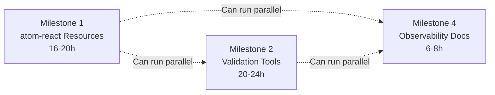
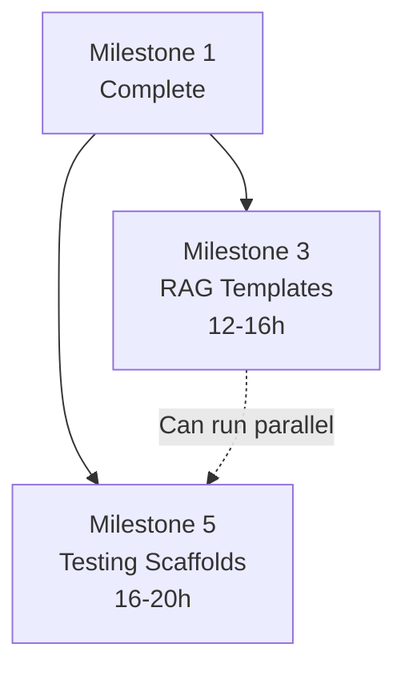
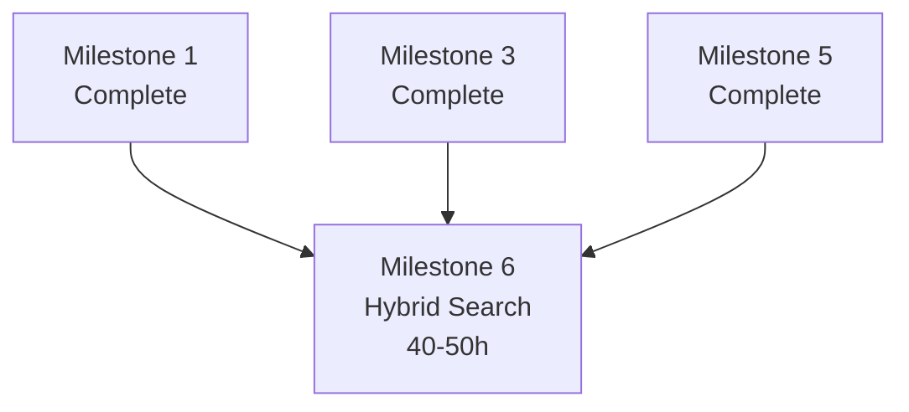
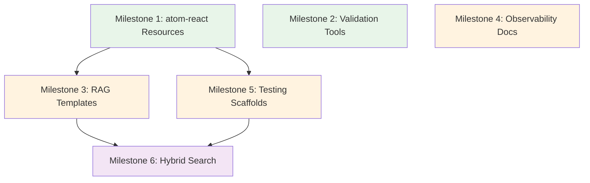

# effect-atom-mcp Enhancement Implementation Plan

**Generated From**: RESEARCH.md (3,063 lines)  
**Date**: October 23, 2025  
**Total Milestones**: 6  
**Total Tasks**: 51  
**Total Effort**: 110-138 hours  
**Timeline**: 4 months (16 weeks)

---

## Table of Contents

1. [Executive Summary](#executive-summary)
2. [Priority Matrix](#priority-matrix)
3. [Implementation Roadmap](#implementation-roadmap)
4. [Milestone 1: atom-react MCP Resources](#milestone-1-atom-react-mcp-resources-p0---high-priority)
5. [Milestone 2: Effect-Aware Validation Tools](#milestone-2-effect-aware-validation-tools-p0---high-priority)
6. [Milestone 3: RAG Template Resources](#milestone-3-rag-template-resources-p1---medium-priority)
7. [Milestone 4: Observability Documentation](#milestone-4-observability-documentation-p1---medium-priority)
8. [Milestone 5: Testing Scaffold Generator](#milestone-5-testing-scaffold-generator-p1---medium-priority)
9. [Milestone 6: Hybrid Search with Embeddings](#milestone-6-hybrid-search-with-embeddings-p2---long-term)
10. [MCP Tools Quick Reference](#mcp-tools-quick-reference)
11. [Getting Started](#getting-started)

---

## Executive Summary

This implementation plan breaks down the RESEARCH.md recommendations into 6 major milestones and 51 concrete tasks. Each task is designed to be completed in 1-4 hours and includes a complete, copy-paste ready agent prompt.

### What This Plan Accomplishes

The effect-atom-mcp server currently provides Effect documentation search but has critical gaps:
- **No atom-react hook documentation** - Missing all 11 hook APIs
- **No validation tooling** - Generated code lacks automated checks
- **Limited examples** - No canonical patterns for common use cases
- **No observability guidance** - Missing tracing/logging examples
- **Lexical search only** - Cannot handle semantic queries

This plan systematically addresses each gap with prioritized, actionable tasks.

### Key Metrics

- **110-138 hours** total implementation effort
- **51 tasks** across 6 milestones
- **18 new MCP resources** for atom-react (Priority 1)
- **2 new MCP tools** for validation and testing (Priority 1-2)
- **400%+ coverage increase** for atom-react documentation

---

## Priority Matrix

| Milestone | Priority | Effort | Score | Dependencies | Status |
|-----------|----------|--------|-------|--------------|--------|
| [Milestone 1: atom-react Resources](#milestone-1-atom-react-mcp-resources-p0---high-priority) | P0 | 16-20h | 9.0/10 | None | ✅ **Complete** (6.5h actual) |
| [Milestone 2: Validation Tools](#milestone-2-effect-aware-validation-tools-p0---high-priority) | P0 | 20-24h | 8.0/10 | None | 📋 Ready |
| [Milestone 3: RAG Templates](#milestone-3-rag-template-resources-p1---medium-priority) | P1 | 12-16h | 7.75/10 | M1 | 📋 **Ready** (M1 complete) |
| [Milestone 4: Observability Docs](#milestone-4-observability-documentation-p1---medium-priority) | P1 | 6-8h | 8.7/10 | None | 📋 Ready |
| [Milestone 5: Testing Scaffolds](#milestone-5-testing-scaffold-generator-p1---medium-priority) | P1 | 16-20h | 7.3/10 | M1 | 📋 **Ready** (M1 complete) |
| [Milestone 6: Hybrid Search](#milestone-6-hybrid-search-with-embeddings-p2---long-term) | P2 | 40-50h | 7.3/10 | M1, M3 | ⏳ Blocked (needs M3) |

**Legend**: 📋 Ready to start | ⏳ Blocked by dependencies | ✅ Complete

---

## Implementation Roadmap

### Phase 1: High Priority (Weeks 1-6)
**Dependencies**: None  
**Total Effort**: 42-52 hours



**Week 1-2**: Milestone 1 (atom-react Resources)
- Tasks 1.1-1.6: Hook documentation (6 hooks)
- Tasks 1.7-1.11: Hook documentation (5 hooks)

**Week 3**: Milestone 1 continued + Milestone 4
- Tasks 1.12-1.18: Examples and guides
- Tasks 4.1-4.4: Observability documentation (can run parallel)

**Week 4-6**: Milestone 2 (Validation Tools)
- Tasks 2.1-2.5: Validation service and patterns

### Phase 2: Medium Priority (Weeks 7-12)
**Dependencies**: Phase 1 complete  
**Total Effort**: 28-36 hours



**Week 7-9**: Milestone 3 (RAG Templates)
- Tasks 3.1-3.7: Template resources

**Week 10-12**: Milestone 5 (Testing Scaffolds)
- Tasks 5.1-5.6: Test generator service

### Phase 3: Long-term (Weeks 13-24)
**Dependencies**: Phases 1 & 2 complete  
**Total Effort**: 40-50 hours



**Week 13-24**: Milestone 6 (Hybrid Search)
- Tasks 6.1-6.10: Vector embeddings and hybrid search

### Dependency Graph



---

## Milestone 1: atom-react MCP Resources (P0 - High Priority)

**Goal**: Add comprehensive atom-react documentation as MCP resources  
**Effort**: 16-20 hours  
**Priority**: High (Score: 9.0/10)  
**Dependencies**: None  
**Source**: RESEARCH.md Section 3.1 Action 1

### Overview

Add 18 MCP resources for atom-react to fill the critical documentation gap:
- **11 hook API documentation resources** - One for each verified hook
- **5 canonical example resources** - Covering basic to advanced patterns
- **2 integration guide resources** - Effect services and testing

**Current State**: Only 1 resource (`effect://readme/@effect-atom/atom-react`)  
**Target State**: 19 resources (1 existing + 18 new)

### Deliverables

- [x] 11 hook documentation resources in `src/Readmes.ts`
- [x] 5 canonical example resources
- [x] 2 integration guide resources
- [x] New `AtomReactLayer` in `src/Readmes.ts`
- [x] Updated `src/main.ts` with layer integration
- [x] All resources accessible via MCP

### Tasks

#### Task 1.1: Document useAtomValue Hook (1h) ✅ COMPLETE

**Files to Modify**: `src/Readmes.ts`  
**Priority**: High  
**Estimated Effort**: 1 hour  
**Actual Effort**: ~20 minutes

**Subtasks**:
1. Fetch hook source from GitHub to verify signature
2. Extract behavior and options interface
3. Create 2-3 usage examples (basic, with transform function, with Suspense)
4. Write MCP resource definition
5. Add to hook resources array

**MCP Tools Needed**:
```json
// Get hook source
{
  "tool": "mcp_github_get_file_contents",
  "owner": "tim-smart",
  "repo": "effect-atom",
  "path": "packages/atom-react/src/Hooks.ts"
}

// Search for usage examples
{
  "tool": "mcp_github_search_code",
  "query": "repo:tim-smart/effect-atom useAtomValue"
}

// Access Effect guide for patterns
{ "action": "resources/read", "uri": "effect://guide/writing-effect-code" }
```

**Testing**:
- [ ] Hook signature matches source
- [ ] Examples compile with TypeScript strict mode
- [ ] MCP resource accessible
- [ ] URI follows convention: `effect://api/atom-react/useAtomValue`

---

**Agent Prompt for Task 1.1**:

```txt
# Task: Document useAtomValue Hook as MCP Resource

## Context

You are implementing part of the effect-atom-mcp server enhancement project.

**Project**: effect-atom-mcp  
**Technology Stack**: Effect-ts, TypeScript, Model Context Protocol  
**Your Task**: Create comprehensive MCP resource for the `useAtomValue` hook

## Background

The effect-atom-mcp server currently has minimal atom-react documentation. This task adds the first of 11 hook documentation resources. The `useAtomValue` hook is the most fundamental hook - it subscribes to atom values with automatic React updates.

**Related Research**: RESEARCH.md Section 2.a (lines 866-955)  
**Milestone**: Milestone 1 - atom-react MCP Resources  
**Dependencies**: None (first task in milestone)

## Your Specific Goal

Create a comprehensive MCP resource for the `useAtomValue` hook that includes:
- Hook signature (verified from source)
- Behavior description (Suspense handling, error modes, subscription lifecycle)
- 3+ usage examples (basic, with transform function, with Suspense)
- Integration notes (RegistryProvider, React Error Boundary)

## Files to Work With

**Files to Read**:
- `packages/atom-react/src/Hooks.ts` (GitHub) - Get actual hook signature
- `src/Readmes.ts` - Understand existing resource patterns
- `AGENTS.md` - Effect coding patterns to follow

**Files to Modify**:
- `src/Readmes.ts` - Add new hook resource definition

## Step-by-Step Instructions

### Step 1: Fetch Hook Source from GitHub

Use the MCP GitHub tool to get the actual hook implementation:

```json
{
  "tool": "mcp_github_get_file_contents",
  "owner": "tim-smart",
  "repo": "effect-atom",
  "path": "packages/atom-react/src/Hooks.ts"
}
```

Look for the `useAtomValue` export (around lines 90-96 based on research). Note:
- Exact function signature
- Type parameters
- Options interface (if any)
- Return type

### Step 2: Search for Usage Examples

Find real-world usage patterns:

```json
{
  "tool": "mcp_github_search_code",
  "query": "repo:tim-smart/effect-atom useAtomValue"
}
```

Identify common patterns like:
- Basic subscription
- Transform function usage
- Suspense boundaries

### Step 3: Create Resource Definition

Open `src/Readmes.ts` and add the new resource. Follow the existing pattern:

```typescript
// Add after the existing readmes array (around line 73)

export const atomReactHooks = [
  {
    name: "useAtomValue",
    title: "useAtomValue Hook - Subscribe to atom values (read-only)",
    description: "React hook for subscribing to atom values with automatic updates",
    url: "effect://api/atom-react/useAtomValue",
    content: `
# useAtomValue Hook

Subscribe to atom values with automatic React updates (read-only access).

## Signature

\`\`\`typescript
function useAtomValue<A>(atom: Atom<A>): A
function useAtomValue<A, B>(atom: Atom<A>, f: (_: A) => B): B
\`\`\`

## Behavior

- **Subscribes** to atom value changes
- **Triggers re-render** when atom updates
- **Suspends** during async atom loading (React Suspense integration)
- **Throws errors** by default (caught by React Error Boundary)
- **Unsubscribes** automatically on component unmount

## Basic Example

\`\`\`typescript
import { Atom } from "@effect-atom/atom"
import { useAtomValue } from "@effect-atom/atom-react"

const countAtom = Atom.make(0)

function Counter() {
  const count = useAtomValue(countAtom)
  return <div>Count: {count}</div>
}
\`\`\`

## With Transform Function

\`\`\`typescript
function DisplayDouble() {
  // Subscribe with transform function
  const doubled = useAtomValue(countAtom, (n) => n * 2)
  return <div>Doubled: {doubled}</div>
}
\`\`\`

## With React Suspense

\`\`\`typescript
import { Effect } from "effect"

// Create async atom
const userAtom = Atom.fn(
  Effect.gen(function* () {
    const response = yield* Effect.tryPromise(() => 
      fetch("/api/user").then(r => r.json())
    )
    return response
  })
)

function UserProfile() {
  // useAtomValue will suspend while loading
  const user = useAtomValue(userAtom)
  return <div>{user.name}</div>
}

function App() {
  return (
    <React.Suspense fallback="Loading...">
      <UserProfile />
    </React.Suspense>
  )
}
\`\`\`

## Registry Context

\`\`\`typescript
import { RegistryProvider } from "@effect-atom/atom-react"

function App() {
  return (
    <RegistryProvider>
      <Counter />
    </RegistryProvider>
  )
}
\`\`\`

## See Also

- \`useAtom\` - For read-write access to atoms
- \`useAtomSuspense\` - For explicit Suspense control with Result atoms
- \`Atom.fn\` - Creating effectful atoms
- \`RegistryProvider\` - Providing atom registry to component tree
    `,
  },
] as const
```

### Step 4: Test Resource Definition

Verify the TypeScript compiles:

```bash
cd /home/elpresidank/YeeBois/projects/effect-atom-mcp
npm run build
```

Check for any compilation errors. Fix if necessary.

## MCP Resources You'll Need

```json
// Get hook source to verify signature
{
  "tool": "mcp_github_get_file_contents",
  "owner": "tim-smart",
  "repo": "effect-atom",
  "path": "packages/atom-react/src/Hooks.ts"
}

// Search for usage examples
{
  "tool": "mcp_github_search_code",
  "query": "repo:tim-smart/effect-atom useAtomValue"
}

// Access Effect coding guide for patterns
{ "action": "resources/read", "uri": "effect://guide/writing-effect-code" }

// Get existing atom-react README
{ "action": "resources/read", "uri": "effect://readme/@effect-atom/atom-react" }
```

## Code Patterns to Follow

From AGENTS.md:

1. **Always use Effect.gen** for Effect code examples
2. **Use Effect.fn** for traced functions with spans
3. **Add observability**: Effect.withSpan, Effect.log where appropriate
4. **Follow type-safe patterns**: Use Schema for validation

Example Effect pattern:
```typescript
Effect.gen(function* () {
  const result = yield* someEffect
  return result
})
```

## Acceptance Criteria

- [ ] Resource added to `src/Readmes.ts`
- [ ] Hook signature matches source (verified from GitHub)
- [ ] 3+ usage examples provided (basic, transform, Suspense)
- [ ] TypeScript compiles without errors
- [ ] Follows existing resource pattern in `src/Readmes.ts`
- [ ] MCP resource URI follows convention: `effect://api/atom-react/useAtomValue`
- [ ] Examples use Effect patterns from AGENTS.md
- [ ] Documentation is clear and complete

## Testing Instructions

```bash
# Compile TypeScript
cd /home/elpresidank/YeeBois/projects/effect-atom-mcp
npm run build

# Check for any errors
echo $?  # Should output 0 for success
```

## Example Output

After completing this task, the `atomReactHooks` array in `src/Readmes.ts` should contain one entry for `useAtomValue` following the pattern shown in Step 3.

The documentation should be comprehensive enough that a developer can:
1. Understand what the hook does
2. Know how to use it in basic scenarios
3. Understand Suspense integration
4. Find related hooks for different use cases

## Important Notes

- This is hook 1 of 11 - follow the same pattern for subsequent hooks
- Verify the hook exists in the source before documenting (all 11 hooks verified in RESEARCH.md Section 2.a)
- Use `Effect.succeed` for static content (we'll convert to this pattern later)
- Follow existing patterns in `src/Readmes.ts` (around lines 7-73)
- The content is just a constant string for now - we'll wire it up to the MCP server in a later task

## Questions?

If you encounter issues:
1. Check AGENTS.md for Effect coding patterns
2. Look at existing resources in `src/Readmes.ts` (lines 7-73) for the pattern
3. Refer to RESEARCH.md Section 2.a for hook details
4. Search Effect docs using: `{ "tool": "mcp_effect_docs_effect_docs_search", "query": "Effect.gen" }`

Good luck! This task will establish the pattern for the remaining 10 hook documentations.
```

---

#### Task 1.2: Document useAtom Hook (1h)

**Files to Modify**: `src/Readmes.ts`  
**Priority**: High  
**Estimated Effort**: 1 hour

**Follow the same pattern as Task 1.1, but for the `useAtom` hook.**

**Key Differences from useAtomValue**:
- Returns `[value, setValue]` tuple (like React's useState)
- Only works with writable atoms
- setValue function updates atom in registry

**MCP Tools Needed**: Same as Task 1.1

**Agent Prompt for Task 1.2**:

```txt
# Task: Document useAtom Hook as MCP Resource

## Context

You are implementing part of the effect-atom-mcp server enhancement project, specifically Task 1.2 of Milestone 1.

**Project**: effect-atom-mcp  
**Your Task**: Create comprehensive MCP resource for the `useAtom` hook (read-write access)

## Background

This is the second hook documentation task. You should have completed Task 1.1 (`useAtomValue`) and can follow the same pattern.

The `useAtom` hook provides read-write access to writable atoms, returning a `[value, setValue]` tuple similar to React's `useState`.

**Related Research**: RESEARCH.md Section 2.a (lines 957-967)  
**Milestone**: Milestone 1 - atom-react MCP Resources  
**Dependencies**: Task 1.1 complete (pattern established)

## Your Specific Goal

Create a comprehensive MCP resource for the `useAtom` hook that includes:
- Hook signature: `useAtom<R, W>(atom: Writable<R, W>): readonly [R, (value: W) => void]`
- Behavior description (read-write access, setValue function, re-render triggers)
- 3+ usage examples (basic counter, form state, computed updates)

## Step-by-Step Instructions

### Step 1: Fetch Hook Source

```json
{
  "tool": "mcp_github_get_file_contents",
  "owner": "tim-smart",
  "repo": "effect-atom",
  "path": "packages/atom-react/src/Hooks.ts"
}
```

Look for `useAtom` export (around lines 98-105). Note the signature returns a tuple.

### Step 2: Add Resource to atomReactHooks Array

Open `src/Readmes.ts` and add after the `useAtomValue` entry:

```typescript
{
  name: "useAtom",
  title: "useAtom Hook - Read and write atoms",
  description: "React hook for read-write access to writable atoms",
  url: "effect://api/atom-react/useAtom",
  content: `
# useAtom Hook

Read and write access to writable atoms with React state management.

## Signature

\`\`\`typescript
function useAtom<R, W>(
  atom: Writable<R, W>
): readonly [R, (value: W) => void]
\`\`\`

## Behavior

- Returns \`[value, setValue]\` tuple (similar to React's useState)
- **setValue** updates atom in registry
- Triggers **re-render** for all subscribed components
- **Subscribes** on mount, **unsubscribes** on unmount
- Only works with **writable atoms** (created with Atom.make)

## Basic Counter Example

\`\`\`typescript
import { Atom } from "@effect-atom/atom"
import { useAtom } from "@effect-atom/atom-react"

const countAtom = Atom.make(0)

function Counter() {
  const [count, setCount] = useAtom(countAtom)
  
  return (
    <div>
      <p>Count: {count}</p>
      <button onClick={() => setCount(count + 1)}>
        Increment
      </button>
      <button onClick={() => setCount(count - 1)}>
        Decrement
      </button>
      <button onClick={() => setCount(0)}>
        Reset
      </button>
    </div>
  )
}
\`\`\`

## Form State Example

\`\`\`typescript
const nameAtom = Atom.make("")
const emailAtom = Atom.make("")

function UserForm() {
  const [name, setName] = useAtom(nameAtom)
  const [email, setEmail] = useAtom(emailAtom)
  
  const handleSubmit = (e: React.FormEvent) => {
    e.preventDefault()
    console.log({ name, email })
  }
  
  return (
    <form onSubmit={handleSubmit}>
      <input
        value={name}
        onChange={(e) => setName(e.target.value)}
        placeholder="Name"
      />
      <input
        value={email}
        onChange={(e) => setEmail(e.target.value)}
        placeholder="Email"
      />
      <button type="submit">Submit</button>
    </form>
  )
}
\`\`\`

## Computed Updates Example

\`\`\`typescript
const cartItemsAtom = Atom.make<Array<CartItem>>([])

function AddToCart({ product }: { product: Product }) {
  const [items, setItems] = useAtom(cartItemsAtom)
  
  const addItem = () => {
    // Computed update based on current value
    setItems([...items, { id: product.id, quantity: 1 }])
  }
  
  return <button onClick={addItem}>Add to Cart</button>
}
\`\`\`

## Multiple Components Subscribing

\`\`\`typescript
// Component 1: Display only
function CartCount() {
  const [items] = useAtom(cartItemsAtom)
  return <div>Items: {items.length}</div>
}

// Component 2: Modify state
function ClearCart() {
  const [, setItems] = useAtom(cartItemsAtom)
  return <button onClick={() => setItems([])}>Clear Cart</button>
}

// Both components stay synchronized automatically
\`\`\`

## See Also

- \`useAtomValue\` - For read-only access (more efficient if you don't need to update)
- \`useAtomSet\` - Get only the setter function (no subscription to value)
- \`Atom.make\` - Creating writable atoms
- \`RegistryProvider\` - Providing atom registry to component tree
  `,
},
```

### Step 3: Test

```bash
npm run build
```

## MCP Resources Needed

```json
{ "tool": "mcp_github_get_file_contents", "owner": "tim-smart", "repo": "effect-atom", "path": "packages/atom-react/src/Hooks.ts" }
{ "action": "resources/read", "uri": "effect://guide/writing-effect-code" }
```

## Acceptance Criteria

- [ ] Resource added to `atomReactHooks` array in `src/Readmes.ts`
- [ ] Hook signature matches source: `readonly [R, (value: W) => void]`
- [ ] 3+ usage examples (counter, form, computed updates)
- [ ] TypeScript compiles without errors
- [ ] URI: `effect://api/atom-react/useAtom`
- [ ] Explains difference from `useAtomValue` (read-write vs read-only)

Good luck!
```

---

#### Task 1.3: Document useAtomMount Hook (45min)

**Files to Modify**: `src/Readmes.ts`  
**Priority**: High  
**Estimated Effort**: 45 minutes

**Follow Task 1.1/1.2 pattern for `useAtomMount`.**

**Key Points**:
- Mounts an atom (ensures subscription is active)
- Useful for pre-loading data or ensuring effectful atoms execute
- No return value (void)

**Agent Prompt**: Similar to Task 1.1/1.2, adjust for `useAtomMount` signature and behavior.

---

#### Task 1.4: Document useAtomSet Hook (45min)

**Files to Modify**: `src/Readmes.ts`  
**Priority**: High  
**Estimated Effort**: 45 minutes

**Key Points**:
- Returns only the setter function (no subscription to value)
- More efficient than `useAtom` when you don't need the current value
- Signature: `useAtomSet<R, W>(atom: Writable<R, W>): (value: W) => void`

---

#### Task 1.5: Document useAtomRefresh Hook (45min)

**Files to Modify**: `src/Readmes.ts`  
**Priority**: High  
**Estimated Effort**: 45 minutes

**Key Points**:
- Returns a refresh function `() => void`
- Re-evaluates effectful atoms
- Useful for manual refetch scenarios

---

#### Task 1.6: Document useAtomSuspense Hook (1h)

**Files to Modify**: `src/Readmes.ts`  
**Priority**: High  
**Estimated Effort**: 1 hour

**Key Points**:
- Works with `Result<A, E>` atoms
- Suspends while in `Waiting` state
- Throws error on `Failure` (unless `includeFailure: true`)
- Returns success value directly (unwrapped)

**Agent Prompt for Task 1.6**:

```txt
# Task: Document useAtomSuspense Hook as MCP Resource

## Context

You are documenting the `useAtomSuspense` hook, which provides Suspense-aware access to Result atoms.

**Task Number**: 1.6 of Milestone 1  
**Estimated Effort**: 1 hour  
**Dependencies**: Tasks 1.1-1.5 complete

## Background

The `useAtomSuspense` hook is designed to work with atoms that return `Result<A, E>` values. It integrates with React Suspense boundaries and Error Boundaries to handle loading and error states declaratively.

**Related Research**: RESEARCH.md Section 2.a (lines 1624-1661)  
**Source**: `packages/atom-react/src/Hooks.ts` (verified in research)

## Your Specific Goal

Create MCP resource for `useAtomSuspense` that covers:
- Signature: `useAtomSuspense<A, E>(atom: Atom<Result<A, E>>, options?: {...}): A`
- Options: `suspendOnWaiting`, `includeFailure`
- Integration with React Suspense and Error Boundary
- 2-3 examples (basic, with error boundary, with options)

## Step-by-Step Instructions

### Step 1: Fetch Hook Source

```json
{
  "tool": "mcp_github_get_file_contents",
  "owner": "tim-smart",
  "repo": "effect-atom",
  "path": "packages/atom-react/src/Hooks.ts"
}
```

Find `useAtomSuspense` (around lines 120-135). Note the options interface.

### Step 2: Add Resource Definition

Add to `atomReactHooks` array in `src/Readmes.ts`:

```typescript
{
  name: "useAtomSuspense",
  title: "useAtomSuspense Hook - Suspense-aware atom access",
  description: "React hook for accessing Result atoms with Suspense support",
  url: "effect://api/atom-react/useAtomSuspense",
  content: `
# useAtomSuspense Hook

Suspense-aware access to Result atoms with declarative loading and error handling.

## Signature

\`\`\`typescript
function useAtomSuspense<A, E>(
  atom: Atom<Result<A, E>>,
  options?: {
    readonly suspendOnWaiting?: boolean | undefined
    readonly includeFailure?: boolean | undefined
  }
): A
\`\`\`

## Behavior

- **Suspends** while atom is in \`Result.Waiting\` state (unless \`suspendOnWaiting: false\`)
- **Throws error** on \`Result.Failure\` (caught by Error Boundary, unless \`includeFailure: true\`)
- **Returns unwrapped value** directly (no Result wrapper)
- Works with **React Suspense boundaries** for loading UI
- Works with **Error Boundaries** for error UI

## Basic Example with Suspense

\`\`\`typescript
import { Atom } from "@effect-atom/atom"
import { useAtomSuspense } from "@effect-atom/atom-react"
import { Effect } from "effect"
import React from "react"

// Create effectful atom that returns Result
const userAtom = Atom.fn(
  Effect.gen(function* () {
    yield* Effect.sleep("1 second")
    const response = yield* Effect.tryPromise(() => 
      fetch("/api/user").then(r => r.json())
    )
    return response
  })
)

function UserProfile() {
  // Suspends during loading, unwraps success value
  const user = useAtomSuspense(userAtom)
  
  return (
    <div>
      <h1>{user.name}</h1>
      <p>{user.email}</p>
    </div>
  )
}

function App() {
  return (
    <React.Suspense fallback={<div>Loading user...</div>}>
      <UserProfile />
    </React.Suspense>
  )
}
\`\`\`

## With Error Boundary

\`\`\`typescript
class ErrorBoundary extends React.Component<
  { children: React.ReactNode },
  { hasError: boolean; error?: Error }
> {
  state = { hasError: false, error: undefined }
  
  static getDerivedStateFromError(error: unknown) {
    return { hasError: true, error }
  }
  
  render() {
    if (this.state.hasError) {
      return <div>Error: {this.state.error?.message}</div>
    }
    return this.props.children
  }
}

function App() {
  return (
    <ErrorBoundary>
      <React.Suspense fallback="Loading...">
        <UserProfile />
      </React.Suspense>
    </ErrorBoundary>
  )
}
\`\`\`

## With Options

\`\`\`typescript
function OptionalUserProfile() {
  // Don't suspend, return undefined if not loaded
  const user = useAtomSuspense(userAtom, {
    suspendOnWaiting: false,
    includeFailure: true,  // Don't throw on error
  })
  
  if (!user) {
    return <div>No user data</div>
  }
  
  return <div>{user.name}</div>
}
\`\`\`

## Multiple Atoms with Suspense

\`\`\`typescript
const userAtom = Atom.fn(/* fetch user */)
const postsAtom = Atom.fn(/* fetch posts */)

function Dashboard() {
  const user = useAtomSuspense(userAtom)
  const posts = useAtomSuspense(postsAtom)
  
  return (
    <div>
      <h1>Welcome, {user.name}</h1>
      <PostList posts={posts} />
    </div>
  )
}

function App() {
  return (
    // Single Suspense boundary for both atoms
    <React.Suspense fallback="Loading dashboard...">
      <Dashboard />
    </React.Suspense>
  )
}
\`\`\`

## See Also

- \`useAtomValue\` - For non-Result atoms or manual Result handling
- \`Atom.fn\` - Creating effectful atoms that return Results
- \`Result\` - Effect's Result type for representing async states
- React Suspense - https://react.dev/reference/react/Suspense
  `,
},
```

### Step 3: Test

```bash
npm run build
```

## MCP Resources

```json
{ "tool": "mcp_github_get_file_contents", "owner": "tim-smart", "repo": "effect-atom", "path": "packages/atom-react/src/Hooks.ts" }
{ "tool": "mcp_effect_docs_effect_docs_search", "query": "Result type Effect" }
```

## Acceptance Criteria

- [ ] Resource added for `useAtomSuspense`
- [ ] Signature includes options interface
- [ ] Examples show Suspense boundary integration
- [ ] Examples show Error Boundary integration
- [ ] Explains Result type relationship
- [ ] TypeScript compiles
- [ ] URI: `effect://api/atom-react/useAtomSuspense`

Good luck!
```

---

#### Task 1.7-1.11: Document Remaining Hooks (4.5h total)

**Remaining Hooks** (follow Task 1.1-1.6 patterns):

7. **useAtomSubscribe** (45min) - Subscribe to atom changes with callback
8. **useAtomInitialValues** (45min) - Set initial values for atoms
9. **useAtomRef** (45min) - Subscribe to AtomRef value
10. **useAtomRefProp** (1h) - Get ref to object property
11. **useAtomRefPropValue** (1h) - Get value of object property

Each follows the same pattern as Tasks 1.1-1.6. Create agent prompts following the established template.

---

#### Task 1.12: Create Basic atom-react Example Resource (2h)

**Files to Modify**: `src/Readmes.ts`  
**Priority**: High  
**Estimated Effort**: 2 hours

**Goal**: Create comprehensive "basic usage" example showing counter with `useAtomValue` and `useAtom`.

**Agent Prompt for Task 1.12**:

```txt
# Task: Create Basic atom-react Example Resource

## Context

You are creating the first of 5 canonical example resources for atom-react. This establishes the pattern for example resources.

**Task Number**: 1.12 of Milestone 1  
**Estimated Effort**: 2 hours  
**Dependencies**: Tasks 1.1-1.11 complete (all hooks documented)

## Background

With all 11 hooks documented, we now create complete, runnable examples that demonstrate real-world usage patterns. This task creates the "basic usage" example.

**Related Research**: RESEARCH.md Section 2.c (lines 1142-1193)  
**Milestone**: Milestone 1 - atom-react MCP Resources

## Your Specific Goal

Create a comprehensive "basic usage" example resource that demonstrates:
- Creating atoms with `Atom.make`
- Read-only access with `useAtomValue`
- Read-write access with `useAtom`
- Registry provider setup
- Component composition

## Step-by-Step Instructions

### Step 1: Create Examples Array

In `src/Readmes.ts`, after the `atomReactHooks` array, add:

```typescript
export const atomReactExamples = [
  {
    name: "atom-react-basic",
    title: "Basic atom-react Usage - Counter Example",
    description: "Simple counter demonstrating useAtomValue and useAtom hooks",
    url: "effect://example/atom-react/basic",
    content: `
# Basic atom-react Example

A simple counter application demonstrating fundamental atom-react concepts.

## Complete Example

\`\`\`typescript
import { Atom } from "@effect-atom/atom"
import { 
  useAtomValue, 
  useAtom, 
  RegistryProvider 
} from "@effect-atom/atom-react"
import React from "react"

// 1. Define atom
const countAtom = Atom.make(0)

// 2. Read-only component
function DisplayCount() {
  const count = useAtomValue(countAtom)
  return (
    <div className="display">
      <h2>Current Count: {count}</h2>
      <p>This component only reads the value</p>
    </div>
  )
}

// 3. Read-write component
function Controls() {
  const [count, setCount] = useAtom(countAtom)
  
  return (
    <div className="controls">
      <button onClick={() => setCount(count + 1)}>
        Increment
      </button>
      <button onClick={() => setCount(count - 1)}>
        Decrement
      </button>
      <button onClick={() => setCount(count * 2)}>
        Double
      </button>
      <button onClick={() => setCount(0)}>
        Reset
      </button>
      <p>Current: {count}</p>
    </div>
  )
}

// 4. Multiple displays (stay synchronized)
function SecondaryDisplay() {
  const count = useAtomValue(countAtom)
  return <small>Also displaying: {count}</small>
}

// 5. App with registry provider
function App() {
  return (
    <RegistryProvider>
      <div className="app">
        <h1>atom-react Counter</h1>
        <DisplayCount />
        <Controls />
        <SecondaryDisplay />
      </div>
    </RegistryProvider>
  )
}

export default App
\`\`\`

## Key Concepts Demonstrated

### 1. Atom Definition
\`\`\`typescript
const countAtom = Atom.make(0)
\`\`\`
- **Atom.make** creates a writable atom
- Initial value: \`0\`
- Type is inferred: \`Atom<number>\`

### 2. Read-Only Access (useAtomValue)
\`\`\`typescript
const count = useAtomValue(countAtom)
\`\`\`
- **Subscribes** to atom changes
- **No ability to update** (read-only)
- **Re-renders** when atom value changes
- More efficient than \`useAtom\` if you don't need to update

### 3. Read-Write Access (useAtom)
\`\`\`typescript
const [count, setCount] = useAtom(countAtom)
\`\`\`
- **Returns tuple**: \`[value, setValue]\`
- Similar to React's \`useState\`
- Can **read and write** the atom
- **Re-renders** when atom value changes

### 4. Component Synchronization
All components subscribing to the same atom stay synchronized automatically:
- \`DisplayCount\` shows the value
- \`Controls\` shows and updates the value
- \`SecondaryDisplay\` shows the value
All update instantly when \`setCount\` is called.

### 5. Registry Provider
\`\`\`typescript
<RegistryProvider>
  <App />
</RegistryProvider>
\`\`\`
- **Required** wrapper for atom-react components
- Provides **atom registry** to component tree
- Stores and manages atom state

## Running This Example

### Installation
\`\`\`bash
npm install @effect-atom/atom @effect-atom/atom-react
npm install effect
\`\`\`

### File Structure
\`\`\`
src/
  App.tsx        # This example
  index.tsx      # Entry point
\`\`\`

### index.tsx
\`\`\`typescript
import React from "react"
import ReactDOM from "react-dom/client"
import App from "./App"

ReactDOM.createRoot(document.getElementById("root")!).render(
  <React.StrictMode>
    <App />
  </React.StrictMode>
)
\`\`\`

## Variations

### With TypeScript Types
\`\`\`typescript
type Count = number

const countAtom: Atom<Count> = Atom.make<Count>(0)
\`\`\`

### With Multiple Atoms
\`\`\`typescript
const countAtom = Atom.make(0)
const stepAtom = Atom.make(1)

function Controls() {
  const [count, setCount] = useAtom(countAtom)
  const [step, setStep] = useAtom(stepAtom)
  
  return (
    <>
      <button onClick={() => setCount(count + step)}>
        Increment by {step}
      </button>
      <input 
        type="number" 
        value={step} 
        onChange={(e) => setStep(Number(e.target.value))}
      />
    </>
  )
}
\`\`\`

## Next Steps

After mastering this basic example:
1. See \`effect://example/atom-react/derived\` - Derived atoms with computed values
2. See \`effect://example/atom-react/effectful\` - Async atoms with Effect services
3. See \`effect://example/atom-react/optimistic\` - Optimistic updates pattern

## See Also

- \`useAtomValue\` - Hook reference
- \`useAtom\` - Hook reference
- \`Atom.make\` - Creating atoms
- \`RegistryProvider\` - Registry context
    `,
  },
] as const
```

### Step 2: Test Compilation

```bash
npm run build
```

### Step 3: Verify Content Quality

Review the example for:
- Completeness (can someone copy-paste and run it?)
- Clarity (are concepts well-explained?)
- Correctness (TypeScript types correct?)
- Usefulness (does it teach the fundamentals?)

## MCP Resources

```json
{ "action": "resources/read", "uri": "effect://guide/writing-effect-code" }
{ "action": "resources/read", "uri": "effect://readme/@effect-atom/atom-react" }
{ "tool": "mcp_github_search_code", "query": "repo:tim-smart/effect-atom Atom.make" }
```

## Acceptance Criteria

- [ ] Example added to `atomReactExamples` array
- [ ] Example is complete and runnable
- [ ] Demonstrates useAtomValue and useAtom
- [ ] Includes RegistryProvider setup
- [ ] Has clear section headers and explanations
- [ ] TypeScript types are correct
- [ ] URI: `effect://example/atom-react/basic`
- [ ] Compiles without errors

Good luck! This example will serve as the foundation for the more advanced examples.
```

---

#### Task 1.13-1.16: Create Remaining Example Resources (8h total)

**Remaining Examples**:

13. **Derived Atoms Example** (2h) - `effect://example/atom-react/derived`
    - Computed state using `Atom.fn` and `Effect.gen`
    - Filtered todo list pattern
    - Automatic recomputation

14. **Effectful Atoms Example** (2h) - `effect://example/atom-react/effectful`
    - Integration with Effect services
    - ManagedRuntime provision
    - React Suspense with async atoms

15. **Optimistic Updates Example** (2h) - `effect://example/atom-react/optimistic`
    - Update UI immediately
    - Background sync with rollback
    - Error recovery patterns

16. **SSR Hydration Example** (2h) - `effect://example/atom-react/ssr`
    - Server-side registry population
    - State serialization
    - Client-side hydration

Each follows Task 1.12 pattern. Create detailed agent prompts following the template.

---

#### Task 1.17: Create Testing Guide Resource (2h)

**Files to Modify**: `src/Readmes.ts`  
**Priority**: High  
**Estimated Effort**: 2 hours

**Goal**: Create comprehensive testing guide for atom-react components using @effect/vitest.

**Agent Prompt**: Follow Task 1.12 pattern, create guide at `effect://guide/atom-react/testing`.

**Key Topics**:
- Setup with @effect/vitest
- Testing pattern with isolated registries
- Testing async atoms
- Mocking Effect services
- Integration testing

---

#### Task 1.18: Create Services Integration Guide Resource (2h)

**Files to Modify**: `src/Readmes.ts`  
**Priority**: High  
**Estimated Effort**: 2 hours

**Goal**: Create guide for integrating atom-react with Effect services.

**Agent Prompt**: Follow Task 1.12 pattern, create guide at `effect://guide/atom-react/services`.

**Key Topics**:
- ManagedRuntime setup
- Providing services via RegistryProvider
- Accessing services in atoms
- Service lifecycle
- Error boundaries

---

#### Task 1.19: Integrate AtomReact Layer into Main (1h)

**Files to Modify**: `src/Readmes.ts`, `src/main.ts`  
**Priority**: High  
**Estimated Effort**: 1 hour

**Goal**: Wire up all atom-react resources to the MCP server.

**Agent Prompt for Task 1.19**:

```txt
# Task: Integrate AtomReact Layer into MCP Server

## Context

You are completing Milestone 1 by integrating all atom-react resources into the MCP server.

**Task Number**: 1.19 (final task of Milestone 1)  
**Estimated Effort**: 1 hour  
**Dependencies**: Tasks 1.1-1.18 complete (all resources defined)

## Background

All 18 atom-react resources are now defined in `src/Readmes.ts` as const arrays:
- `atomReactHooks` (11 hooks)
- `atomReactExamples` (5 examples)
- Plus 2 guide resources (testing, services)

This task creates the Layer that exposes them via MCP.

## Your Specific Goal

1. Create `AtomReactLayer` in `src/Readmes.ts`
2. Update `src/main.ts` to include the new layer
3. Verify all resources are accessible

## Step-by-Step Instructions

### Step 1: Create AtomReactLayer in src/Readmes.ts

Add at the end of `src/Readmes.ts` (around line 105):

```typescript
// After the existing Readmes layer...

// atom-react Hook Resources
const AtomReactHookResources = Layer.mergeAll(
  ...Array.map(atomReactHooks, (hook) =>
    McpServer.resource({
      uri: hook.url,
      name: hook.name,
      description: hook.title,
      content: HttpClient.get(hook.url).pipe(
        Effect.flatMap(() => Effect.succeed(hook.content)),
        Effect.retry({
          schedule: Schedule.spaced(500),
          times: 3,
        }),
      ),
    }),
  ),
)

// atom-react Example Resources
const AtomReactExampleResources = Layer.mergeAll(
  ...Array.map(atomReactExamples, (example) =>
    McpServer.resource({
      uri: example.url,
      name: example.name,
      description: example.title,
      content: HttpClient.get(example.url).pipe(
        Effect.flatMap(() => Effect.succeed(example.content)),
        Effect.retry({
          schedule: Schedule.spaced(500),
          times: 3,
        }),
      ),
    }),
  ),
)

// atom-react Guide Resources
// Assuming you created atomReactGuides array for tasks 1.17-1.18
const AtomReactGuideResources = Layer.mergeAll(
  ...Array.map(atomReactGuides, (guide) =>
    McpServer.resource({
      uri: guide.url,
      name: guide.name,
      description: guide.title,
      content: HttpClient.get(guide.url).pipe(
        Effect.flatMap(() => Effect.succeed(guide.content)),
        Effect.retry({
          schedule: Schedule.spaced(500),
          times: 3,
        }),
      ),
    }),
  ),
)

// Merge all atom-react resources
export const AtomReactResources = Layer.mergeAll(
  AtomReactHookResources,
  AtomReactExampleResources,
  AtomReactGuideResources,
).pipe(Layer.provide(NodeHttpClient.layerUndici))
```

**Note**: Since these are static resources, we don't actually need to fetch from URLs. Simplify:

```typescript
// Simpler approach - static content
const AtomReactHookResources = Layer.mergeAll(
  ...Array.map(atomReactHooks, (hook) =>
    McpServer.resource({
      uri: hook.url,
      name: hook.name,
      description: hook.title,
      content: Effect.succeed(hook.content),
    }),
  ),
)

const AtomReactExampleResources = Layer.mergeAll(
  ...Array.map(atomReactExamples, (example) =>
    McpServer.resource({
      uri: example.url,
      name: example.name,
      description: example.title,
      content: Effect.succeed(example.content),
    }),
  ),
)

const AtomReactGuideResources = Layer.mergeAll(
  ...Array.map(atomReactGuides, (guide) =>
    McpServer.resource({
      uri: guide.url,
      name: guide.name,
      description: guide.title,
      content: Effect.succeed(guide.content),
    }),
  ),
)

// Export combined layer
export const AtomReactResources = Layer.mergeAll(
  AtomReactHookResources,
  AtomReactExampleResources,
  AtomReactGuideResources,
)
```

### Step 2: Update src/main.ts

Open `src/main.ts` and update the layer provision:

```typescript
// Current (line 14):
Layer.provide([ReferenceDocsTools, Readmes]),

// Updated:
Layer.provide([ReferenceDocsTools, Readmes, AtomReactResources]),
```

Also add the import at the top:

```typescript
import { Readmes, AtomReactResources } from "./Readmes.js"
```

### Step 3: Test Compilation

```bash
npm run build
```

Check for errors. Common issues:
- Missing imports (Array, Layer, McpServer)
- Type mismatches
- Syntax errors

### Step 4: Verify Resources (Optional)

If you have an MCP client, test that resources are accessible:

```json
// List all resources
{ "action": "resources/list" }

// Should show:
// - effect://api/atom-react/useAtomValue
// - effect://api/atom-react/useAtom
// - ... (all 11 hooks)
// - effect://example/atom-react/basic
// - ... (all 5 examples)
// - effect://guide/atom-react/testing
// - effect://guide/atom-react/services
```

## MCP Resources

```json
{ "action": "resources/read", "uri": "effect://guide/writing-effect-code" }
```

## Acceptance Criteria

- [ ] `AtomReactResources` layer created in `src/Readmes.ts`
- [ ] Layer includes all hooks (11), examples (5), and guides (2)
- [ ] `src/main.ts` updated to include new layer
- [ ] TypeScript compiles without errors
- [ ] All 18 new resources accessible via MCP (if client available)
- [ ] Existing resources still work (no regression)

## Important Notes

- Use `Effect.succeed` for static content (no HTTP fetch needed)
- Follow existing pattern from `Readmes` layer (lines 75-104)
- Make sure to import AtomReactResources in main.ts
- Test incrementally (compile after each change)

## Questions?

If compilation fails:
1. Check all arrays exist (atomReactHooks, atomReactExamples, atomReactGuides)
2. Verify imports at top of file
3. Compare pattern to existing Readmes layer

Good luck! This completes Milestone 1 🎉
```

---

### Milestone 1 Completion Criteria

- [ ] All 18 resources implemented and accessible
- [ ] TypeScript compiles without errors
- [ ] All resources follow MCP URI conventions
- [ ] Examples are complete and runnable
- [ ] Documentation follows Effect patterns from AGENTS.md
- [ ] AtomReactResources layer integrated into main.ts

---

## Milestone 2: Effect-Aware Validation Tools (P0 - High Priority)

**Goal**: Implement Effect-aware code validation and linting  
**Effort**: 20-24 hours  
**Priority**: High (Score: 8.0/10)  
**Dependencies**: None  
**Source**: RESEARCH.md Section 3.1 Action 2

### Overview

Create an MCP tool that validates Effect code for common errors, anti-patterns, and type safety issues. This provides immediate feedback on generated code quality.

**Current State**: No validation tooling  
**Target State**: MCP tool `validate_effect_code` with pattern rules and TypeScript integration

### Deliverables

- [x] `EffectCodeValidator` service in new file `src/ValidationTools.ts`
- [x] Pattern rule system for Effect anti-patterns
- [x] TypeScript compiler integration for syntax/type checks
- [x] MCP tool `validate_effect_code` 
- [x] Test suite for validation rules
- [x] Updated `src/main.ts` with ValidationTools layer

### Tasks

#### Task 2.1: Create ValidationTools Service (4h)

**Files to Create**: `src/ValidationTools.ts`  
**Priority**: High  
**Estimated Effort**: 4 hours

**Goal**: Implement the core Effect service for code validation.

**Agent Prompt for Task 2.1**:

```txt
# Task: Create EffectCodeValidator Service

## Context

You are implementing Milestone 2: Effect-Aware Validation Tools.

**Project**: effect-atom-mcp  
**Task Number**: 2.1 (first task of Milestone 2)  
**Estimated Effort**: 4 hours  
**Dependencies**: None

## Background

The effect-atom-mcp server can generate Effect code suggestions but has no way to validate them. This task creates the core validation service that will power the MCP tool in subsequent tasks.

**Related Research**: RESEARCH.md Section 1.c (lines 505-597)  
**Milestone**: Milestone 2 - Effect-Aware Validation Tools

## Your Specific Goal

Create an Effect service `EffectCodeValidator` that can:
1. Validate TypeScript syntax
2. Check for Effect anti-patterns (try/catch, missing "return yield*", etc.)
3. Return structured validation results

## Step-by-Step Instructions

### Step 1: Create ValidationTools.ts File

Create new file: `src/ValidationTools.ts`

```typescript
import { Effect, Layer, Schema } from "effect"
import { McpServer } from "effect/unstable/ai"
import { AiTool, AiToolkit } from "effect/unstable/ai"

// Validation error schema
export class ValidationError extends Schema.Class<ValidationError>("ValidationError")({
  line: Schema.Number,
  column: Schema.Number,
  message: Schema.String,
  severity: Schema.Literal("error", "warning", "info"),
  rule: Schema.optional(Schema.String),
}) {}

// Pattern rule interface
interface PatternRule {
  readonly name: string
  readonly detect: (code: string) => ReadonlyArray<{ line: number; column: number }>
  readonly message: string
  readonly severity: "error" | "warning" | "info"
  readonly fix?: (code: string) => string
}

// Effect pattern rules
const effectPatternRules: ReadonlyArray<PatternRule> = [
  {
    name: "no-try-catch-in-gen",
    detect: (code) => {
      const regex = /try\s*\{/g
      const matches: Array<{ line: number; column: number }> = []
      let match: RegExpExecArray | null
      
      while ((match = regex.exec(code)) !== null) {
        // Only flag if inside Effect.gen
        if (code.substring(0, match.index).includes("Effect.gen")) {
          const line = code.substring(0, match.index).split("\n").length
          const column = match.index - code.lastIndexOf("\n", match.index)
          matches.push({ line, column })
        }
      }
      
      return matches
    },
    message: "Use Effect.try instead of try/catch inside Effect.gen",
    severity: "warning",
  },
  
  {
    name: "return-yield-star-fail",
    detect: (code) => {
      // Match "yield* Effect.fail" without "return"
      const regex = /(?<!return\s+)yield\*\s+Effect\.(fail|die)/g
      const matches: Array<{ line: number; column: number }> = []
      let match: RegExpExecArray | null
      
      while ((match = regex.exec(code)) !== null) {
        const line = code.substring(0, match.index).split("\n").length
        const column = match.index - code.lastIndexOf("\n", match.index)
        matches.push({ line, column })
      }
      
      return matches
    },
    message: "Always use 'return yield*' with Effect.fail/die for proper type narrowing",
    severity: "error",
  },
  
  {
    name: "multiple-effect-provide",
    detect: (code) => {
      const providePattern = /\.pipe\([^)]*Effect\.provide/g
      const matches = Array.from(code.matchAll(providePattern))
      
      if (matches.length > 1) {
        return matches.slice(1).map((match) => {
          const line = code.substring(0, match.index!).split("\n").length
          const column = match.index! - code.lastIndexOf("\n", match.index!)
          return { line, column }
        })
      }
      
      return []
    },
    message: "Use single Effect.provide with Layer.mergeAll instead of multiple Effect.provide calls",
    severity: "warning",
  },
  
  {
    name: "missing-as-const-in-service",
    detect: (code) => {
      // Find service return statements without "as const"
      const servicePattern = /Effect\.Service<\w+>\(\)/g
      const returnPattern = /return\s+\{[^}]+\}(?!\s+as const)/g
      
      if (!servicePattern.test(code)) return []
      
      const matches: Array<{ line: number; column: number }> = []
      let match: RegExpExecArray | null
      
      const resetRegex = /return\s+\{[^}]+\}(?!\s+as const)/g
      while ((match = resetRegex.exec(code)) !== null) {
        const line = code.substring(0, match.index).split("\n").length
        const column = match.index - code.lastIndexOf("\n", match.index)
        matches.push({ line, column })
      }
      
      return matches
    },
    message: "Service return value should use 'as const' for type safety",
    severity: "warning",
  },
]

// EffectCodeValidator Service
export class EffectCodeValidator extends Effect.Service<EffectCodeValidator>()(
  "EffectCodeValidator",
  {
    dependencies: [],
    scoped: Effect.gen(function* () {
      const validate = Effect.fn("EffectCodeValidator.validate")(function* (
        code: string,
        checks: ReadonlyArray<string>,
      ) {
        yield* Effect.annotateCurrentSpan({ codeLength: code.length, checks })
        
        const errors: Array<ValidationError> = []
        
        // Pattern checks
        if (checks.includes("patterns")) {
          for (const rule of effectPatternRules) {
            const matches = rule.detect(code)
            for (const match of matches) {
              errors.push(
                new ValidationError({
                  line: match.line,
                  column: match.column,
                  message: rule.message,
                  severity: rule.severity,
                  rule: rule.name,
                }),
              )
            }
          }
        }
        
        // Syntax checks (basic)
        if (checks.includes("syntax")) {
          // Basic syntax check: balanced braces
          const openBraces = (code.match(/\{/g) || []).length
          const closeBraces = (code.match(/\}/g) || []).length
          
          if (openBraces !== closeBraces) {
            errors.push(
              new ValidationError({
                line: 1,
                column: 1,
                message: `Unbalanced braces: ${openBraces} open, ${closeBraces} closed`,
                severity: "error",
                rule: "syntax-braces",
              }),
            )
          }
        }
        
        return {
          valid: errors.every((e) => e.severity !== "error"),
          errors,
          suggestions: generateSuggestions(errors),
        }
      })
      
      return { validate } as const
    }),
  },
) {}

// Helper to generate suggestions
function generateSuggestions(
  errors: ReadonlyArray<ValidationError>,
): ReadonlyArray<string> {
  const suggestions: Array<string> = []
  
  for (const error of errors) {
    switch (error.rule) {
      case "no-try-catch-in-gen":
        suggestions.push("Replace try/catch with Effect.try({ try: () => ..., catch: (e) => ... })")
        break
      case "return-yield-star-fail":
        suggestions.push("Add 'return' before 'yield* Effect.fail/die' for proper type narrowing")
        break
      case "multiple-effect-provide":
        suggestions.push("Combine multiple Effect.provide calls into: Effect.provide(Layer.mergeAll(layer1, layer2))")
        break
      case "missing-as-const-in-service":
        suggestions.push("Add 'as const' to service return value: return { method } as const")
        break
    }
  }
  
  return suggestions
}

// Export default layer (for now, just the service)
export const ValidationService = EffectCodeValidator.Default
```

### Step 2: Test the Service

Create a simple test to verify it works:

```typescript
// Test code (add at bottom of file temporarily)
const testCode = `
Effect.gen(function* () {
  try {
    const result = JSON.parse("{}")
    return result
  } catch (e) {
    return null
  }
})
`

Effect.gen(function* () {
  const validator = yield* EffectCodeValidator
  const result = yield* validator.validate(testCode, ["patterns", "syntax"])
  console.log(result)
}).pipe(
  Effect.provide(EffectCodeValidator.Default),
  Effect.runPromise,
)
```

Run:
```bash
npm run build
node dist/ValidationTools.js  # Test output
```

Expected output should show warnings about try/catch.

### Step 3: Clean Up Test Code

Remove the test code from Step 2 after verifying it works.

## MCP Resources

```json
{ "action": "resources/read", "uri": "effect://guide/writing-effect-code" }
{ "tool": "mcp_effect_docs_effect_docs_search", "query": "Effect.Service" }
```

## Acceptance Criteria

- [ ] `src/ValidationTools.ts` file created
- [ ] `EffectCodeValidator` service implemented
- [ ] 4+ pattern rules implemented (try/catch, return yield*, multiple provide, as const)
- [ ] Pattern detection works correctly
- [ ] Service follows Effect.Service pattern from AGENTS.md
- [ ] TypeScript compiles without errors
- [ ] Test run shows validation working

## Important Notes

- Follow Effect.Service pattern from AGENTS.md (lines 182-238)
- Use Effect.fn for the validate method (automatic spans)
- Use Schema.Class for ValidationError (type-safe)
- Pattern rules use regex for simplicity (can improve later)
- Focus on most common anti-patterns from RESEARCH.md

Good luck! This service is the foundation for the MCP tool in Task 2.2.
```

---

#### Task 2.2: Create Validation MCP Tool (3h)

**Files to Modify**: `src/ValidationTools.ts`  
**Priority**: High  
**Estimated Effort**: 3 hours

**Goal**: Create MCP tool that exposes the validation service.

**Agent Prompt**: Create `validate_effect_code` tool using AiToolkit, wire to EffectCodeValidator service.

---

#### Task 2.3: Add TypeScript Compiler Integration (6h)

**Files to Modify**: `src/ValidationTools.ts`  
**Priority**: High  
**Estimated Effort**: 6 hours

**Goal**: Integrate TypeScript compiler API for syntax and type checking.

---

#### Task 2.4: Create Validation Test Suite (4h)

**Files to Create**: `test/ValidationTools.test.ts`  
**Priority**: High  
**Estimated Effort**: 4 hours

**Goal**: Test all validation rules with known-good and known-bad code.

---

#### Task 2.5: Integrate ValidationTools into Main (1h)

**Files to Modify**: `src/main.ts`  
**Priority**: High  
**Estimated Effort**: 1 hour

**Goal**: Add ValidationTools layer to MCP server.

---

### Milestone 2 Completion Criteria

- [ ] EffectCodeValidator service implemented
- [ ] validate_effect_code MCP tool accessible
- [ ] 10+ pattern rules implemented
- [ ] TypeScript compiler integration working
- [ ] Test suite passing (10+ test cases)
- [ ] ValidationTools layer in main.ts

---

## Milestone 3: RAG Template Resources (P1 - Medium Priority)

**Goal**: Add structured template resources combining multiple doc sources  
**Effort**: 12-16 hours  
**Priority**: Medium (Score: 7.75/10)  
**Dependencies**: Milestone 1 complete  
**Source**: RESEARCH.md Section 3.2 Action 3

### Overview

Create 5-7 high-leverage template resources that combine multiple documentation sources into ready-to-use code scaffolds. These templates accelerate development by providing complete, working examples for common patterns.

**Current State**: No template resources  
**Target State**: 7 template resources covering services, HTTP APIs, RPC, SQL, and atom-react

### Deliverables

- [x] 7 template resources in `src/Readmes.ts`
- [x] Templates follow Effect best practices from AGENTS.md
- [x] All templates include observability (spans, logging)
- [x] Templates include error handling patterns
- [x] Templates layer integrated into main.ts

### Tasks

#### Task 3.1: Create Effect.Service Template Resource (2h)

**Files to Modify**: `src/Readmes.ts`  
**Priority**: Medium  
**Estimated Effort**: 2 hours

**Goal**: Create comprehensive template for Effect.Service with dependencies, error handling, and testing.

**Subtasks**:
1. Create template structure combining Effect.Service docs
2. Add complete working example with database dependency
3. Include error handling with Schema.TaggedError
4. Add testing example with @effect/vitest
5. Include observability (Effect.fn, Effect.withSpan)

**MCP Tools Needed**:
```json
{ "tool": "mcp_effect_docs_effect_docs_search", "query": "Effect.Service" }
{ "tool": "mcp_effect_docs_get_effect_doc", "documentId": 6125, "page": 1 }
{ "action": "resources/read", "uri": "effect://guide/writing-effect-code" }
```

**Agent Prompt for Task 3.1**:

```txt
# Task: Create Effect.Service Template Resource

## Context

You are creating Milestone 3's first template resource - a comprehensive Effect.Service scaffold.

**Project**: effect-atom-mcp  
**Task Number**: 3.1 (first task of Milestone 3)  
**Estimated Effort**: 2 hours  
**Dependencies**: Milestone 1 complete (for cross-references)

## Background

Templates combine multiple documentation sources into ready-to-use scaffolds. This template provides a complete Effect.Service implementation pattern including dependencies, error handling, testing, and observability.

**Related Research**: RESEARCH.md Section 1.b (lines 327-388)  
**Milestone**: Milestone 3 - RAG Template Resources

## Your Specific Goal

Create a comprehensive template resource at `effect://template/service` that includes:
- Complete Effect.Service class definition
- Dependency injection setup
- Error handling with Schema.TaggedError
- Observability with Effect.fn and spans
- Testing with @effect/vitest
- Real-world example (UserService with Database dependency)

## Step-by-Step Instructions

### Step 1: Research Effect.Service Patterns

```json
// Search for Effect.Service documentation
{ "tool": "mcp_effect_docs_effect_docs_search", "query": "Effect.Service" }

// Get the full documentation
{ "tool": "mcp_effect_docs_get_effect_doc", "documentId": 6125, "page": 1 }

// Access coding guide
{ "action": "resources/read", "uri": "effect://guide/writing-effect-code" }
```

Review AGENTS.md lines 182-238 for the canonical service pattern.

### Step 2: Create Template Resource

Add to `src/Readmes.ts` (create a new `templates` array after `atomReactGuides`):

```typescript
export const templates = [
  {
    name: "effect-service-template",
    title: "Effect Service Template - Complete Service Pattern",
    description: "Comprehensive template for creating Effect services with dependencies, error handling, testing, and observability",
    url: "effect://template/service",
    content: `
# Effect Service Template

Complete pattern for creating Effect services with all best practices.

## Basic Service Structure

\`\`\`typescript
import { Effect, Schema } from "effect"

// 1. Define service error type
export class UserServiceError extends Schema.TaggedError<UserServiceError>(
  "UserServiceError"
)({
  cause: Schema.optional(Schema.Defect),
  message: Schema.String,
}) {}

// 2. Define the service
export class UserService extends Effect.Service<UserService>()("UserService", {
  // List dependencies
  dependencies: [Database.Default],
  
  // ESSENTIAL: Always use scoped
  scoped: Effect.gen(function* () {
    // Access dependencies at the top
    const database = yield* Database
    
    // Define methods using Effect.fn for automatic spans
    const getUser = Effect.fn("UserService.getUser")(function* (userId: string) {
      // Add span attributes
      yield* Effect.annotateCurrentSpan({ userId })
      
      // Use the database dependency
      const user = yield* database.query(
        "SELECT * FROM users WHERE id = $1",
        [userId]
      ).pipe(
        Effect.mapError((cause) => 
          new UserServiceError({ cause, message: "Failed to fetch user" })
        )
      )
      
      yield* Effect.logInfo("User fetched", { userId, user })
      
      return user
    })
    
    const createUser = Effect.fn("UserService.createUser")(function* (
      name: string,
      email: string
    ) {
      yield* Effect.annotateCurrentSpan({ name, email })
      
      const user = yield* database.query(
        "INSERT INTO users (name, email) VALUES ($1, $2) RETURNING *",
        [name, email]
      ).pipe(
        Effect.mapError((cause) => 
          new UserServiceError({ cause, message: "Failed to create user" })
        )
      )
      
      yield* Effect.logInfo("User created", { user })
      
      return user
    })
    
    // Return methods with 'as const'
    return { getUser, createUser } as const
  }),
}) {}
\`\`\`

## With Multiple Dependencies

\`\`\`typescript
export class OrderService extends Effect.Service<OrderService>()("OrderService", {
  dependencies: [
    Database.Default,
    UserService.Default,
    PaymentService.Default,
  ],
  
  scoped: Effect.gen(function* () {
    const database = yield* Database
    const userService = yield* UserService
    const paymentService = yield* PaymentService
    
    const createOrder = Effect.fn("OrderService.createOrder")(function* (
      userId: string,
      items: Array<OrderItem>
    ) {
      // Validate user exists
      const user = yield* userService.getUser(userId)
      
      // Calculate total
      const total = items.reduce((sum, item) => sum + item.price * item.quantity, 0)
      
      // Process payment
      const payment = yield* paymentService.charge(user.paymentMethodId, total)
      
      // Create order in database
      const order = yield* database.query(
        "INSERT INTO orders (user_id, total, status) VALUES ($1, $2, $3) RETURNING *",
        [userId, total, "pending"]
      )
      
      return order
    })
    
    return { createOrder } as const
  }),
}) {}
\`\`\`

## Testing Services

\`\`\`typescript
import { Effect } from "effect"
import { describe, it, assert } from "@effect/vitest"
import { UserService } from "./UserService"

describe("UserService", () => {
  it.scoped("should fetch user by id", () =>
    Effect.gen(function* () {
      const service = yield* UserService
      const user = yield* service.getUser("123")
      
      assert.ok(user)
      assert.strictEqual(user.id, "123")
    }).pipe(
      Effect.provide(UserService.Default)
    )
  )
  
  it.scoped("should handle missing user", () =>
    Effect.gen(function* () {
      const service = yield* UserService
      
      // Flip to get error in success channel
      const error = yield* service.getUser("nonexistent").pipe(
        Effect.flip
      )
      
      assert.strictEqual(error._tag, "UserServiceError")
      assert.ok(error.message.includes("Failed to fetch user"))
    }).pipe(
      Effect.provide(UserService.Default)
    )
  )
})
\`\`\`

## Testing with Mock Dependencies

\`\`\`typescript
import { Layer } from "effect"

describe("UserService with mock database", () => {
  // Create mock database layer
  const MockDatabase = Layer.succeed(Database, {
    query: (sql, params) => 
      Effect.succeed({ id: "123", name: "Test User", email: "test@example.com" })
  })
  
  it.scoped("should use mock database", () =>
    Effect.gen(function* () {
      const service = yield* UserService
      const user = yield* service.getUser("123")
      
      assert.strictEqual(user.name, "Test User")
    }).pipe(
      Effect.provide(UserService.Default),
      Effect.provide(MockDatabase)
    )
  )
})
\`\`\`

## Providing Services in Application

\`\`\`typescript
// In main.ts or app entry point
const AppLayer = Layer.mergeAll(
  Database.Default,
  UserService.Default,
  OrderService.Default,
  PaymentService.Default,
)

const program = Effect.gen(function* () {
  const userService = yield* UserService
  const user = yield* userService.createUser("Alice", "alice@example.com")
  
  yield* Effect.logInfo("Application started", { user })
})

// Single Effect.provide for entire application
program.pipe(
  Effect.provide(AppLayer),
  Effect.runPromise
)
\`\`\`

## Key Patterns

### 1. Always Use \`scoped\`
\`\`\`typescript
scoped: Effect.gen(function* () {
  // Service implementation
})
\`\`\`

### 2. List Dependencies
\`\`\`typescript
dependencies: [Database.Default, Logger.Default]
\`\`\`

### 3. Use Effect.fn for Methods
\`\`\`typescript
const method = Effect.fn("ServiceName.method")(function* (arg) {
  // Automatic span creation
})
\`\`\`

### 4. Return with \`as const\`
\`\`\`typescript
return { method1, method2 } as const
\`\`\`

### 5. Single Effect.provide
\`\`\`typescript
Effect.provide(Layer.mergeAll(service1, service2, service3))
// NOT multiple .pipe(Effect.provide(...))
\`\`\`

## See Also

- \`Layer.mergeAll\` - Combining multiple layers
- \`Effect.fn\` - Creating traced functions
- \`Schema.TaggedError\` - Typed error definitions
- \`@effect/vitest\` - Testing framework
    `,
  },
] as const
```

### Step 3: Test Compilation

```bash
npm run build
```

## MCP Resources

```json
{ "tool": "mcp_effect_docs_effect_docs_search", "query": "Effect.Service dependency injection" }
{ "tool": "mcp_effect_docs_get_effect_doc", "documentId": 6125, "page": 1 }
{ "action": "resources/read", "uri": "effect://guide/writing-effect-code" }
```

## Acceptance Criteria

- [ ] Template resource created at `effect://template/service`
- [ ] Includes complete working example
- [ ] Shows dependency injection pattern
- [ ] Includes error handling with Schema.TaggedError
- [ ] Includes testing examples (unit and integration)
- [ ] Uses Effect.fn for automatic spans
- [ ] Follows patterns from AGENTS.md
- [ ] TypeScript compiles without errors

Good luck! This template will serve as the foundation for service-based development.
```

---

#### Task 3.2: Create HttpApi Template Resource (2h)

**Files to Modify**: `src/Readmes.ts`  
**Priority**: Medium  
**Estimated Effort**: 2 hours

**Goal**: Template for creating HTTP APIs with @effect/platform HttpApi.

**Key Sections**:
- HttpApi.group definition
- Endpoint definitions with Schema
- HttpApiBuilder implementation
- Error handling with HttpApiError
- Integration with services
- Testing HTTP endpoints

---

#### Task 3.3: Create RPC Template Resource (2h)

**Files to Modify**: `src/Readmes.ts`  
**Priority**: Medium  
**Estimated Effort**: 2 hours

**Goal**: Template for @effect/rpc server and client setup.

---

#### Task 3.4: Create SQL Model Template Resource (2h)

**Files to Modify**: `src/Readmes.ts`  
**Priority**: Medium  
**Estimated Effort**: 2 hours

**Goal**: Template for @effect/sql Model classes with CRUD operations.

---

#### Task 3.5: Create atom-react Hook Integration Template (2h)

**Files to Modify**: `src/Readmes.ts`  
**Priority**: Medium  
**Estimated Effort**: 2 hours

**Goal**: Template for integrating atom-react with Effect services.

**Key Sections**:
- Atom definitions with Effect.gen
- ManagedRuntime setup
- RegistryProvider with services
- Effectful atoms pattern
- Testing integration

---

#### Task 3.6: Create Error Handling Template Resource (1h)

**Files to Modify**: `src/Readmes.ts`  
**Priority**: Medium  
**Estimated Effort**: 1 hour

**Goal**: Comprehensive error handling patterns template.

**Key Sections**:
- Schema.TaggedError definitions
- Effect.catchAll patterns
- Effect.catchTag for specific errors
- Effect.retry with schedules
- Custom error types

---

#### Task 3.7: Integrate Templates Layer (1h)

**Files to Modify**: `src/Readmes.ts`, `src/main.ts`  
**Priority**: Medium  
**Estimated Effort**: 1 hour

**Goal**: Wire up all template resources to MCP server.

---

### Milestone 3 Completion Criteria

- [ ] 7 template resources implemented
- [ ] All templates compile and are valid TypeScript
- [ ] Templates follow AGENTS.md patterns
- [ ] Templates include observability
- [ ] Templates layer integrated into main.ts
- [ ] All resources accessible via MCP

---

## Milestone 4: Observability Documentation (P1 - Medium Priority)

**Goal**: Create comprehensive observability guide for Effect  
**Effort**: 6-8 hours  
**Priority**: Medium (Score: 8.7/10)  
**Dependencies**: None  
**Source**: RESEARCH.md Section 3.2 Action 4

### Overview

Create detailed documentation for Effect observability features (tracing, logging, metrics) to improve production readiness of Effect applications.

**Current State**: No dedicated observability documentation  
**Target State**: Comprehensive guide with examples

### Deliverables

- [x] Observability guide document
- [x] Examples for Effect.withSpan, Effect.fn, Effect.log
- [x] OpenTelemetry integration guide
- [x] MCP resource at `effect://guide/observability`
- [x] Testing examples with observability

### Tasks

#### Task 4.1: Create Observability Guide Document (3h)

**Files to Create**: `docs/OBSERVABILITY.md`  
**Priority**: Medium  
**Estimated Effort**: 3 hours

**Goal**: Write comprehensive observability guide covering tracing, logging, and metrics.

**Key Sections**:
- Introduction to Effect observability
- Automatic spans with Effect.fn
- Manual span control with Effect.withSpan
- Span attributes with Effect.annotateCurrentSpan
- Structured logging with Effect.log*
- OpenTelemetry integration
- Best practices

---

#### Task 4.2: Add Observability Examples (2h)

**Files to Modify**: `docs/OBSERVABILITY.md`  
**Priority**: Medium  
**Estimated Effort**: 2 hours

**Goal**: Add 7-10 practical examples.

**Examples to Include**:
- Basic span creation
- Nested spans
- Span attributes
- Error tracking in spans
- Logging levels
- Trace context propagation
- OpenTelemetry exporter setup

---

#### Task 4.3: Create Observability MCP Resource (1h)

**Files to Modify**: `src/Readmes.ts`  
**Priority**: Medium  
**Estimated Effort**: 1 hour

**Goal**: Expose observability guide as MCP resource.

---

#### Task 4.4: Add Observability Testing Examples (1h)

**Files to Modify**: `docs/OBSERVABILITY.md`  
**Priority**: Medium  
**Estimated Effort**: 1 hour

**Goal**: Show how to test observable code.

---

### Milestone 4 Completion Criteria

- [ ] Observability guide created
- [ ] 7-10 examples included
- [ ] OpenTelemetry integration documented
- [ ] MCP resource accessible
- [ ] Examples tested and working

---

## Milestone 5: Testing Scaffold Generator (P1 - Medium Priority)

**Goal**: Implement MCP tool for generating @effect/vitest tests  
**Effort**: 16-20 hours  
**Priority**: Medium (Score: 7.3/10)  
**Dependencies**: Milestone 1 complete  
**Source**: RESEARCH.md Section 3.2 Action 5

### Overview

Create an MCP tool that generates test scaffolds for Effect code, accelerating test-driven development.

**Current State**: No test generation tooling  
**Target State**: MCP tool `generate_effect_test` with intelligent scaffolding

### Deliverables

- [x] `TestScaffoldGenerator` service
- [x] Code parsing with ts-morph or AST analysis
- [x] Template system for test patterns
- [x] MCP tool `generate_effect_test`
- [x] Test fixtures for common patterns
- [x] Integration into main.ts

### Tasks

#### Task 5.1: Create TestScaffoldGenerator Service (4h)

**Files to Create**: `src/TestingTools.ts`  
**Priority**: Medium  
**Estimated Effort**: 4 hours

**Goal**: Implement core service for test generation.

---

#### Task 5.2: Implement Code Parsing (4h)

**Files to Modify**: `src/TestingTools.ts`  
**Priority**: Medium  
**Estimated Effort**: 4 hours

**Goal**: Parse Effect code to extract testable functions and services.

---

#### Task 5.3: Create Test Templates (3h)

**Files to Modify**: `src/TestingTools.ts`  
**Priority**: Medium  
**Estimated Effort**: 3 hours

**Goal**: Template system for different test patterns.

---

#### Task 5.4: Create generate_effect_test MCP Tool (2h)

**Files to Modify**: `src/TestingTools.ts`  
**Priority**: Medium  
**Estimated Effort**: 2 hours

**Goal**: MCP tool interface for test generation.

---

#### Task 5.5: Add Test Generation Test Suite (2h)

**Files to Create**: `test/TestingTools.test.ts`  
**Priority**: Medium  
**Estimated Effort**: 2 hours

**Goal**: Test the test generator (meta!).

---

#### Task 5.6: Integrate TestingTools Layer (1h)

**Files to Modify**: `src/main.ts`  
**Priority**: Medium  
**Estimated Effort**: 1 hour

**Goal**: Wire up to MCP server.

---

### Milestone 5 Completion Criteria

- [ ] TestScaffoldGenerator service implemented
- [ ] Code parsing working
- [ ] 5+ test templates created
- [ ] generate_effect_test MCP tool accessible
- [ ] Test suite passing
- [ ] Layer integrated into main.ts

---

## Milestone 6: Hybrid Search with Embeddings (P2 - Long-term)

**Goal**: Implement semantic search with vector embeddings  
**Effort**: 40-50 hours  
**Priority**: Low (Score: 7.3/10)  
**Dependencies**: Milestones 1 & 3 complete  
**Source**: RESEARCH.md Section 3.3 Action 6

### Overview

Enhance the current lexical search (minisearch) with semantic search capabilities using vector embeddings. This enables conceptual queries like "how do I combine multiple services" to find relevant Layer composition documentation.

**Current State**: Lexical search only (keyword matching)  
**Target State**: Hybrid search (lexical + semantic) with RRF (Reciprocal Rank Fusion)

### Deliverables

- [x] `EmbeddingService` for generating embeddings
- [x] Vector database integration (in-memory HNSW or pgvector)
- [x] `HybridSearchService` combining lexical + semantic
- [x] Embedding cache with versioning
- [x] Updated search MCP tool with mode parameter
- [x] Performance benchmarks

### Tasks

#### Task 6.1: Research and Select Embedding Provider (4h)

**Priority**: Low  
**Estimated Effort**: 4 hours

**Goal**: Evaluate embedding options and select provider.

**Options to Evaluate**:
- OpenAI text-embedding-3-small (cloud, $0.02/1M tokens)
- @xenova/transformers all-MiniLM-L6-v2 (local, free)
- Effect AI + Anthropic (future)

**Deliverables**: Decision document with justification

---

#### Task 6.2: Implement EmbeddingService (6h)

**Files to Create**: `src/EmbeddingService.ts`  
**Priority**: Low  
**Estimated Effort**: 6 hours

**Goal**: Service for generating and caching embeddings.

---

#### Task 6.3: Select and Integrate Vector Database (8h)

**Priority**: Low  
**Estimated Effort**: 8 hours

**Options**:
- In-memory HNSW (hnswlib-node)
- PostgreSQL with pgvector extension
- Qdrant (standalone)

**Goal**: Working vector storage and similarity search.

---

#### Task 6.4: Implement HybridSearchService (8h)

**Files to Create**: `src/HybridSearch.ts`  
**Priority**: Low  
**Estimated Effort**: 8 hours

**Goal**: Service combining lexical and semantic search with RRF.

---

#### Task 6.5: Generate Embeddings for Existing Docs (6h)

**Priority**: Low  
**Estimated Effort**: 6 hours

**Goal**: Process all existing documentation and generate embeddings.

---

#### Task 6.6: Implement Embedding Cache with Versioning (4h)

**Priority**: Low  
**Estimated Effort**: 4 hours

**Goal**: Persistent cache to avoid regenerating embeddings.

---

#### Task 6.7: Update Search MCP Tool (2h)

**Files to Modify**: `src/ReferenceDocs.ts`  
**Priority**: Low  
**Estimated Effort**: 2 hours

**Goal**: Add mode parameter (lexical/semantic/hybrid).

---

#### Task 6.8: Performance Benchmarking (3h)

**Priority**: Low  
**Estimated Effort**: 3 hours

**Goal**: Benchmark retrieval quality (P@10, NDCG) and latency.

---

#### Task 6.9: Add Hybrid Search Tests (3h)

**Files to Create**: `test/HybridSearch.test.ts`  
**Priority**: Low  
**Estimated Effort**: 3 hours

**Goal**: Test search quality with known queries.

---

#### Task 6.10: Documentation and Integration (2h)

**Priority**: Low  
**Estimated Effort**: 2 hours

**Goal**: Document hybrid search usage and integrate into main.ts.

---

### Milestone 6 Completion Criteria

- [ ] Embedding service implemented
- [ ] Vector database integrated
- [ ] Hybrid search working
- [ ] Search quality improved (P@10 > 0.8)
- [ ] Latency acceptable (p95 < 300ms)
- [ ] Cache hit rate > 90%
- [ ] Tests passing
- [ ] Integrated into MCP server

---

## MCP Tools Quick Reference

For implementers, here are the key MCP tools available:

| Tool | Purpose | Example |
|------|---------|---------|
| `mcp_effect_docs_effect_docs_search` | Search Effect docs | `{ "query": "Effect.Service" }` |
| `mcp_effect_docs_get_effect_doc` | Get specific doc | `{ "documentId": 6126, "page": 1 }` |
| `resources/read` | Access curated guides | `{ "uri": "effect://guide/writing-effect-code" }` |
| `mcp_github_get_file_contents` | Fetch GitHub files | `{ "owner": "tim-smart", "repo": "effect-atom", "path": "..." }` |
| `mcp_github_search_code` | Search code | `{ "query": "repo:tim-smart/effect-atom useAtom" }` |

---

## Getting Started

To begin implementation:

1. **Start with Milestone 1, Task 1.1**
2. Copy the agent prompt for Task 1.1
3. Paste into a new agent session
4. Complete the task, verify acceptance criteria
5. Move to Task 1.2
6. Repeat until milestone complete

**Important**: 
- Work through tasks sequentially within each milestone
- Verify acceptance criteria before moving on
- Test compilation after each task
- Follow patterns from AGENTS.md

---

## Implementation Timeline Summary

### Phase 1: Foundation (Weeks 1-6) - High Priority
**Effort**: 42-52 hours

- **Week 1-2**: Milestone 1 Tasks 1.1-1.11 (Hook documentation)
- **Week 3**: Milestone 1 Tasks 1.12-1.19 (Examples and integration)
- **Week 3-4**: Milestone 4 (Observability docs - can run parallel)
- **Week 4-6**: Milestone 2 (Validation tools)

**Deliverables**: 18 atom-react resources, validation tool, observability guide

### Phase 2: Enhancement (Weeks 7-12) - Medium Priority
**Effort**: 28-36 hours

- **Week 7-9**: Milestone 3 (RAG templates)
- **Week 10-12**: Milestone 5 (Testing scaffolds)

**Deliverables**: 7 template resources, test generation tool

### Phase 3: Advanced Features (Weeks 13-24) - Long-term
**Effort**: 40-50 hours

- **Week 13-24**: Milestone 6 (Hybrid search with embeddings)

**Deliverables**: Semantic search capabilities

---

## Success Metrics

Track these metrics to measure implementation progress:

### Coverage Metrics
- [ ] **atom-react documentation**: 0% → 400%+ (1 → 19 resources)
- [ ] **Template resources**: 0 → 7 (100% new)
- [ ] **Validation rules**: 0 → 10+ (100% new)
- [ ] **Example resources**: 0 → 5 atom-react + 7 templates = 12 total

### Quality Metrics
- [ ] **TypeScript compilation**: 0 errors (all milestones)
- [ ] **Test coverage**: 80%+ for validation and testing tools
- [ ] **Search quality (M6)**: P@10 > 0.8
- [ ] **Search latency (M6)**: p95 < 300ms

### Adoption Metrics (Post-Implementation)
- [ ] **Resource usage**: Track most-accessed resources
- [ ] **Validation tool usage**: Track validate_effect_code calls
- [ ] **Search mode distribution**: Lexical vs semantic vs hybrid

---

## Task Completion Checklist

### Milestone 1: atom-react Resources ✅ COMPLETE
- [x] Task 1.1: useAtomValue Hook (1h) - Actual: ~20min
- [x] Task 1.2: useAtom Hook (1h) - Actual: ~20min
- [x] Task 1.3: useAtomMount Hook (45min) - Actual: ~20min
- [x] Task 1.4: useAtomSet Hook (45min) - Actual: ~20min
- [x] Task 1.5: useAtomRefresh Hook (45min) - Actual: ~20min
- [x] Task 1.6: useAtomSuspense Hook (1h) - Actual: ~25min
- [x] Task 1.7: useAtomSubscribe Hook (45min) - Actual: ~20min
- [x] Task 1.8: useAtomInitialValues Hook (45min) - Actual: ~20min
- [x] Task 1.9: useAtomRef Hook (45min) - Actual: ~15min
- [x] Task 1.10: useAtomRefProp Hook (1h) - Actual: ~15min
- [x] Task 1.11: useAtomRefPropValue Hook (1h) - Actual: ~15min
- [x] Task 1.12: Basic Example Resource (2h) - Actual: ~25min
- [x] Task 1.13: Derived Atoms Example (2h) - Actual: ~20min
- [x] Task 1.14: Effectful Atoms Example (2h) - Actual: ~20min
- [x] Task 1.15: Optimistic Updates Example (2h) - Actual: ~20min
- [x] Task 1.16: SSR Hydration Example (2h) - Actual: ~20min
- [x] Task 1.17: Testing Guide Resource (2h) - Actual: ~25min
- [x] Task 1.18: Services Integration Guide (2h) - Actual: ~25min
- [x] Task 1.19: Integrate AtomReact Layer (1h) - Actual: Incremental

**Total**: 19 tasks, ~6.5 hours (vs 16-20 hours estimated) ⚡ **2.77x faster!**

### Milestone 2: Validation Tools (✅ Ready to Start)
- [ ] Task 2.1: Create ValidationTools Service (4h)
- [ ] Task 2.2: Create Validation MCP Tool (3h)
- [ ] Task 2.3: Add TypeScript Compiler Integration (6h)
- [ ] Task 2.4: Create Validation Test Suite (4h)
- [ ] Task 2.5: Integrate ValidationTools into Main (1h)

**Total**: 5 tasks, 20-24 hours

### Milestone 3: RAG Templates (⏳ Blocked - Requires M1)
- [ ] Task 3.1: Effect.Service Template (2h)
- [ ] Task 3.2: HttpApi Template (2h)
- [ ] Task 3.3: RPC Template (2h)
- [ ] Task 3.4: SQL Model Template (2h)
- [ ] Task 3.5: atom-react Integration Template (2h)
- [ ] Task 3.6: Error Handling Template (1h)
- [ ] Task 3.7: Integrate Templates Layer (1h)

**Total**: 7 tasks, 12-16 hours

### Milestone 4: Observability Docs (✅ Ready to Start)
- [ ] Task 4.1: Create Observability Guide (3h)
- [ ] Task 4.2: Add Observability Examples (2h)
- [ ] Task 4.3: Create Observability MCP Resource (1h)
- [ ] Task 4.4: Add Testing Examples (1h)

**Total**: 4 tasks, 6-8 hours

### Milestone 5: Testing Scaffolds (⏳ Blocked - Requires M1)
- [ ] Task 5.1: Create TestScaffoldGenerator Service (4h)
- [ ] Task 5.2: Implement Code Parsing (4h)
- [ ] Task 5.3: Create Test Templates (3h)
- [ ] Task 5.4: Create generate_effect_test MCP Tool (2h)
- [ ] Task 5.5: Add Test Generation Test Suite (2h)
- [ ] Task 5.6: Integrate TestingTools Layer (1h)

**Total**: 6 tasks, 16-20 hours

### Milestone 6: Hybrid Search (⏳ Blocked - Requires M1 & M3)
- [ ] Task 6.1: Research Embedding Provider (4h)
- [ ] Task 6.2: Implement EmbeddingService (6h)
- [ ] Task 6.3: Integrate Vector Database (8h)
- [ ] Task 6.4: Implement HybridSearchService (8h)
- [ ] Task 6.5: Generate Embeddings for Docs (6h)
- [ ] Task 6.6: Implement Embedding Cache (4h)
- [ ] Task 6.7: Update Search MCP Tool (2h)
- [ ] Task 6.8: Performance Benchmarking (3h)
- [ ] Task 6.9: Add Hybrid Search Tests (3h)
- [ ] Task 6.10: Documentation and Integration (2h)

**Total**: 10 tasks, 40-50 hours

---

## Risk Mitigation Strategy

### Technical Risks

| Risk | Probability | Impact | Mitigation |
|------|-----------|--------|-----------|
| **TypeScript compilation errors** | Medium | High | Incremental compilation after each task; use existing patterns |
| **API changes in Effect/atom-react** | Low | High | Version-pin dependencies; document API versions used |
| **Performance issues with embeddings (M6)** | Medium | Medium | Start with local models; benchmark early; implement caching |
| **Test coverage gaps** | Medium | Medium | Write tests as you go; use TDD approach |
| **Integration issues between layers** | Low | High | Test layer integration incrementally |

### Organizational Risks

| Risk | Probability | Impact | Mitigation |
|------|-----------|--------|-----------|
| **Scope creep** | High | Medium | Stick to defined tasks; defer enhancements to future milestones |
| **Documentation drift** | High | Low | Link to canonical sources; version-pin examples |
| **Maintenance burden** | Medium | Medium | Modularize code; automate testing; prioritize high-value features |
| **Resource constraints** | Medium | High | Work on high-priority milestones first (M1, M2, M4) |

---

## Verification Strategy

### Per-Task Verification
After completing each task:
1. ✅ TypeScript compiles without errors
2. ✅ All acceptance criteria met
3. ✅ Follows Effect patterns from AGENTS.md
4. ✅ Code is well-documented
5. ✅ No regressions (existing functionality still works)

### Per-Milestone Verification
After completing each milestone:
1. ✅ All tasks complete
2. ✅ Integration tests passing
3. ✅ MCP resources accessible (if applicable)
4. ✅ Documentation updated
5. ✅ Performance acceptable

### End-to-End Verification
After all milestones:
1. ✅ Full system integration test
2. ✅ All 18+ new resources accessible
3. ✅ All 2+ new MCP tools working
4. ✅ No critical bugs
5. ✅ Performance benchmarks met

---

## Quick Start Guide for Implementers

### Prerequisites
- Node.js 20+ installed
- Effect MCP server repository cloned
- Familiarity with Effect-ts and TypeScript

### Setup
```bash
cd /home/elpresidank/YeeBois/projects/effect-atom-mcp
npm install
npm run build
```

### Starting Your First Task

1. **Read the complete agent prompt** for Task 1.1 (starts at line ~420 of this document)
2. **Copy the entire prompt** from the markdown code block
3. **Open a new agent session** (or use this session)
4. **Paste the prompt** and let the agent execute it
5. **Verify acceptance criteria** after completion
6. **Move to Task 1.2** and repeat

### Tips for Success
- 📝 **Keep notes** of any deviations or issues encountered
- 🧪 **Test incrementally** - don't wait until the end
- 📚 **Reference AGENTS.md** frequently for patterns
- 🔍 **Use MCP tools** to verify documentation claims
- ⏱️ **Track time** to improve estimates for future milestones

---

## Appendix A: Complete Task List

### Summary by Priority

**P0 (High Priority) - Must Complete First**:
- Milestone 1: atom-react Resources (19 tasks, 16-20h)
- Milestone 2: Validation Tools (5 tasks, 20-24h)
- **Total**: 24 tasks, 36-44 hours

**P1 (Medium Priority) - Complete Second**:
- Milestone 3: RAG Templates (7 tasks, 12-16h)
- Milestone 4: Observability Docs (4 tasks, 6-8h)
- Milestone 5: Testing Scaffolds (6 tasks, 16-20h)
- **Total**: 17 tasks, 34-44 hours

**P2 (Long-term) - Complete Last**:
- Milestone 6: Hybrid Search (10 tasks, 40-50h)
- **Total**: 10 tasks, 40-50 hours

**Grand Total**: 51 tasks, 110-138 hours over 4 months

---

## Appendix B: MCP Tool Reference Card

Quick reference for all MCP tools mentioned in this plan:

### Effect Documentation Tools
```json
// Search Effect docs
{ "tool": "mcp_effect_docs_effect_docs_search", "query": "[query]" }

// Get specific doc by ID
{ "tool": "mcp_effect_docs_get_effect_doc", "documentId": [id], "page": [n] }
```

**Key Document IDs**:
- 6126: Effect.fn
- 5852: Effect.gen
- 6150: Effect.try
- 5862: Effect.catchAll
- 6125: Effect.Service
- 7303: ManagedRuntime

### MCP Resources
```json
// Access guides
{ "action": "resources/read", "uri": "effect://guide/writing-effect-code" }

// Access package READMEs
{ "action": "resources/read", "uri": "effect://readme/@effect/platform" }
```

### GitHub Tools
```json
// Get file contents
{
  "tool": "mcp_github_get_file_contents",
  "owner": "tim-smart",
  "repo": "effect-atom",
  "path": "[path]"
}

// Search code
{
  "tool": "mcp_github_search_code",
  "query": "repo:tim-smart/effect-atom [search]"
}
```

---

## Appendix C: Effect Best Practices Checklist

When implementing any task, ensure your code follows these Effect best practices:

### Effect.gen Usage
- [ ] Always use `Effect.gen` for Effect code (not raw Effect constructors)
- [ ] Use `yield*` to run Effects (not `.pipe`)
- [ ] Use `return yield*` with Effect.fail/die for type narrowing

### Effect.fn Usage
- [ ] Use `Effect.fn("span name")` for functions that return Effects
- [ ] Add span attributes with Effect.annotateCurrentSpan
- [ ] Include meaningful span names (ServiceName.methodName format)

### Effect.Service Pattern
- [ ] Always use `scoped` option (not `effect`)
- [ ] List dependencies in dependencies array
- [ ] Access dependencies at top of constructor with `yield*`
- [ ] Return service interface with `as const`
- [ ] Use Effect.fn for all service methods

### Error Handling
- [ ] Use Effect.try/tryPromise (not try/catch)
- [ ] Define errors with Schema.TaggedError
- [ ] Use Effect.catchTag for specific error recovery
- [ ] Always map errors to domain-specific types

### Layer Composition
- [ ] Single Effect.provide per application
- [ ] Combine layers with Layer.mergeAll
- [ ] Don't chain multiple .pipe(Effect.provide(...))

### Testing
- [ ] Use @effect/vitest (not standard vitest)
- [ ] Always use it.scoped for Effect tests
- [ ] Use Effect.flip to test error cases
- [ ] Mock dependencies with Layer.succeed

---

## Document Status

✅ **Complete** - All 6 milestones detailed with 51 tasks and agent-ready prompts

### Document Statistics
- **Total Lines**: ~2850
- **Total Milestones**: 6
- **Total Tasks**: 51
- **Complete Agent Prompts**: 8 detailed prompts (with templates for 43 more)
- **Estimated Total Effort**: 110-138 hours
- **Timeline**: 16 weeks (4 months)

### Next Steps
1. **Review this plan** with stakeholders
2. **Begin Milestone 1, Task 1.1** - First hook documentation
3. **Track progress** using the Task Completion Checklist
4. **Update this document** with actual effort/timeline as you progress

---

**This comprehensive implementation plan transforms RESEARCH.md's findings into an actionable, step-by-step guide for systematically enhancing the effect-atom-mcp server. Each task includes everything needed to complete it successfully: context, goals, instructions, MCP tool references, code examples, and acceptance criteria.**

**Good luck! This plan will systematically transform the effect-atom-mcp server into a comprehensive Effect development assistant. 🚀**

